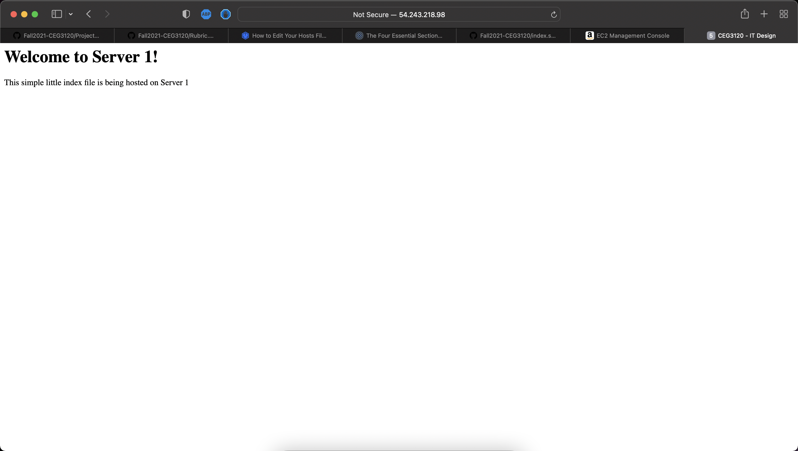

**Project5**
**Sam Schafer**

1. I "sudo vim /etc/hosts" and added the private IPs and hostnames of my two webservers.

2. I SSH between webserver1 and webserver2 on my proxy server using by creating a ~/.ssh/config file where I included the hostnames, private ips and the private key used to connect to each server.

3. I installed the haproxy software on my proxy server by using the cf template userdata installation where softeware will be installed prior to the aws servers launching. 

    * The haproxy.cfg file was renamed to haproxy.cfg.old
    * I then created a new haproxy.cfg file and included this:
            global 
            maxconn 50000	
            log /dev/log local0
            user haproxy
            group haproxy
            stats socket /run/haproxy/admin.sock user haproxy group haproxy mode 660 level admin

        defaults
            timeout connect 10s
            timeout client 30s
            timeout server 30s
            log global
            mode tcp
            option tcplog
            maxconn 3000

        frontend front
            bind 10.0.0.25:80
            default_backend content_pool

        backend content_pool
            balance roundrobin
            server webserver1 54.237.18.8:80
            server webserver2 54.198.162.65
    * To restart the haproxy service use these commands:
        - sudo systemctl stop haproxy.service
        - sudo systemctl restart haproxy.service
    * The resources used were:
        - https://www.haproxy.com/blog/the-four-essential-sections-of-an-haproxy-configuration/

4. I installed the apache2 software on each of my webservers under the userdata in my cf template. 
    * I went to var/www/html/index.html and modified the content of that file on both webserver1 and webserver2 to include the given index.srv1.html and index.srv2.html file contents.

    * the commands to stop and start apache2 are as follows:
        - sudo service apache2 stop
        - sudo service apache2 restart
5. 
    
    

6. link to my webserver:
        - http://54.243.218.98 
